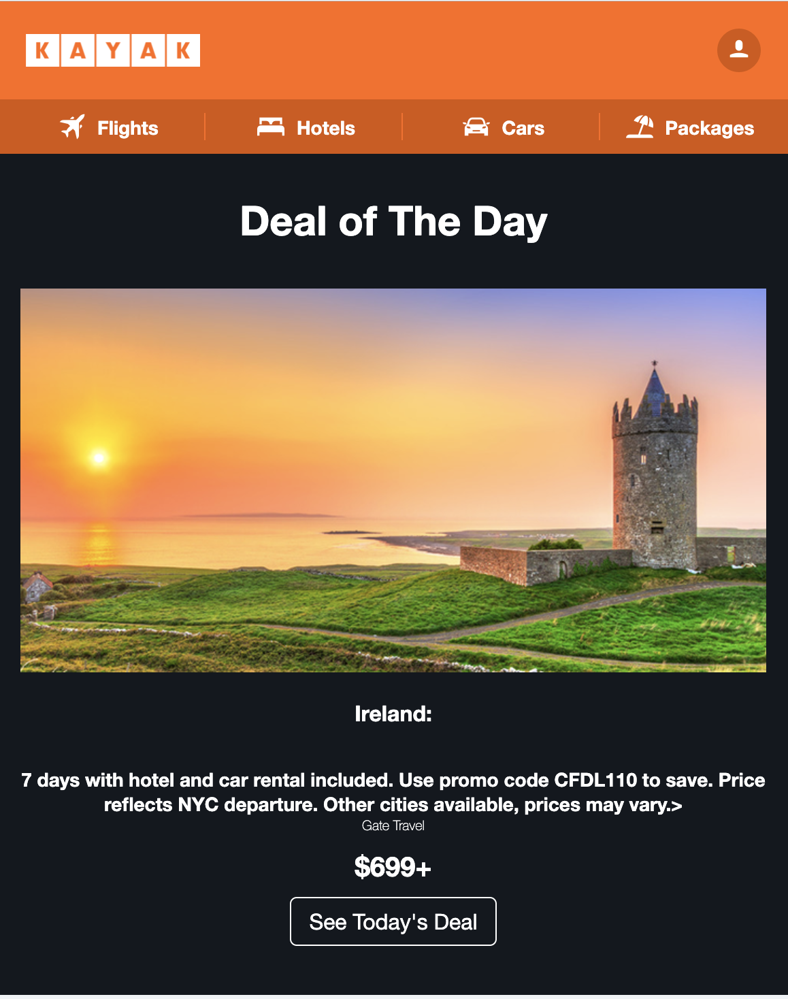
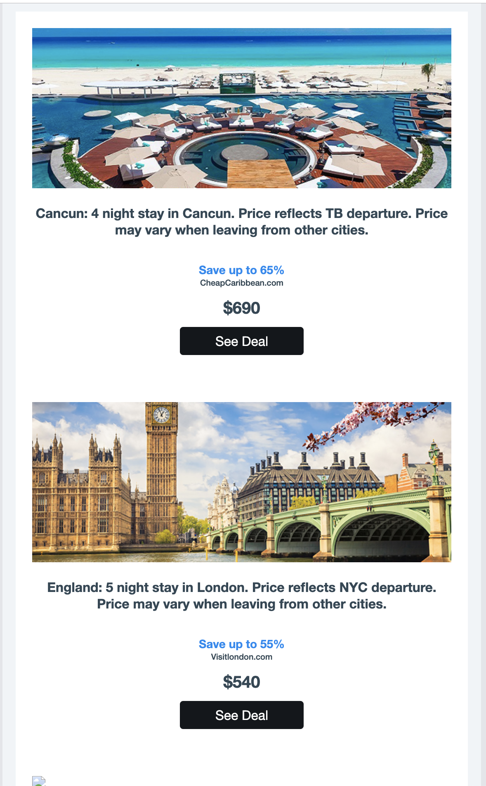
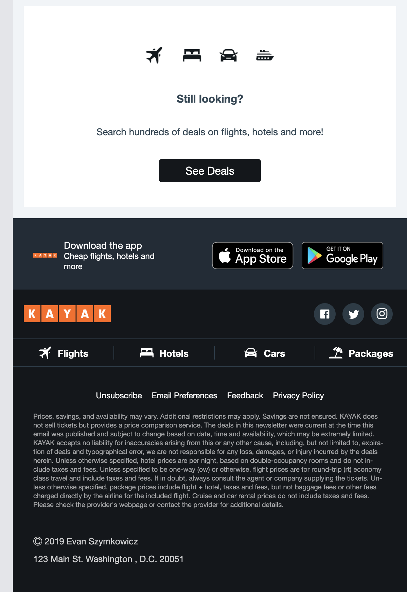

# Recreating a Kayak HTML email with the Foundation framework. Image pack provided by Coding Phase.

I was using a different set of colors before to avoid infringing...but then I realize it looks better with their color scheme.

## Build Commands

Run `npm start` to kick off the build process. A new browser tab will open with a server pointing to your project files.

Run `npm run build` to inline your CSS into your HTML along with the rest of the build process.

Run `npm run litmus` to build as above, then submit to litmus for testing. *AWS S3 Account details required (config.json)*

Run `npm run mail` to build as above, then send to specified email address for testing. *SMTP server details required (config.json)*

Run `npm run zip` to build as above, then zip HTML and images for easy deployment to email marketing services.

### Speeding Up Your Build

If you create a lot of emails, your build can start to slow down, as each build rebuilds all of the emails in the
repository. A simple way to keep it fast is to archive emails you no longer need by moving the pages into `src/pages/archive`.
You can also move images that are no longer needed into `src/assets/img/archive`. The build will ignore pages and images that
are inside the archive folder.

## Litmus Tests (config.json)

Testing in Litmus requires the images to be hosted publicly. The provided gulp task handles this by automating hosting to an AWS S3 account. Provide your Litmus and AWS S3 account details in the `example.config.json` and then rename to `config.json`. Litmus config, and `aws.url` are required, however if you follow the [aws-sdk suggestions](http://docs.aws.amazon.com/AWSJavaScriptSDK/guide/node-configuring.html) you don't need to supply the AWS credentials into this JSON.
